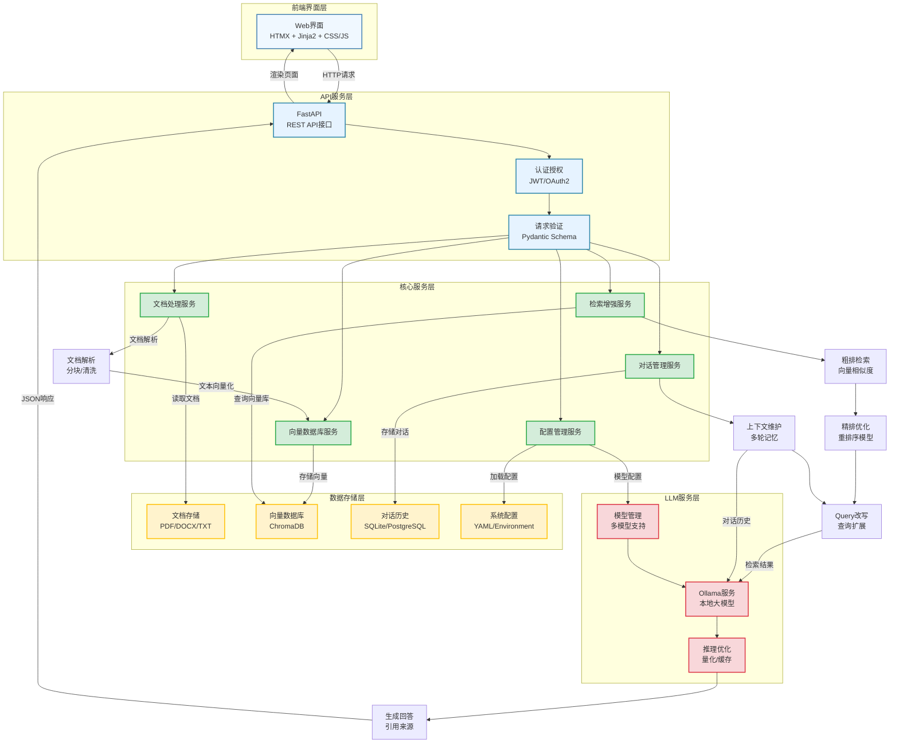

# RAG Local Enterprise System

> 本地化企业级 RAG（Retrieval-Augmented Generation）知识库系统

学习 & 开源项目，旨在提供一个可扩展的 RAG 实现，并作为学习总结。


***

## 📌 项目概述

RAG Local Enterprise System 是一个面向企业的本地化问答系统，支持多文档管理、本地向量化检索、LLM 推理与对话历史管理，具备模块化、可扩展和易部署的特性。

项目目标：


1. 学习 RAG 系统设计与实现

2. 提供可部署的开源 RAG 框架

3. 支持本地化、多文档、多租户部署


***

## 🏗 技术架构




***

## 🚀 功能阶段

### 第一阶段：基础功能实现


* 文档上传与处理

* 本地向量化存储

* 基础问答

* 简单前端界面

### 第二阶段：增强功能


* 多文档管理

* 对话历史管理

* Query 改写与扩展

* 粗排 + 精排算法

### 第三阶段：企业级特性


* 用户权限管理

* 多租户支持

* 监控与日志

* 性能优化


***

## 🛠 技术栈

**后端**：


* FastAPI, LangChain, ChromaDB, Sentence-Transformers, Ollama, loguru

**前端**：


* HTMX, Jinja2, Vanilla JS/CSS


***

## 📂 项目结构


```
rag-local-enterprise-system/

├── backend/               # 后端代码

│   ├── api/               # 路由和接口

│   ├── core/              # 配置与依赖

│   ├── models/            # 数据模型

│   ├── schemas/           # Pydantic schema

│   ├── services/          # 核心业务逻辑

│   └── utils/             # 工具模块（如日志、异常处理）

├── frontend/              # 前端模板和静态资源

├── data/                  # 数据存储

│   ├── documents/        # 原始文档

│   └── vector\_db/        # 向量数据库持久化

├── tests/                 # 测试代码

├── pyproject.toml        # 项目配置

├── uv.toml               # uv 项目配置

├── makefile              # 开发任务脚本

├── Dockerfile            # 容器化文件

├── docker-compose.yml    # 容器编排

└── README.md             # 项目说明
```


***

## ⚡ 快速上手

### 1. 克隆项目


```
git clone https://github.com/LeafInCode/RAG-Local-Enterprise-System.git

cd rag-local-enterprise-system
```

### 2. 创建虚拟环境


```
uv venv --python 3.12

source .venv/bin/activate
```

### 3. 安装依赖


```
uv pip install -e .
```

### 4. 启动项目


```
make serve
```

访问：`http://localhost:8000`


***

## 🧪 测试


```
make lint

make format

make typecheck
```


***

## 📦 部署方案

### 本地开发


* 使用 uvicorn 开发服务器，支持热重载

### 生产部署


* Docker 容器化部署

* Docker Compose 编排


***

## 📜 License

MIT License


***

## 💡 贡献

欢迎提交 PR，Fork 后修改，Issue 讨论功能优化。
